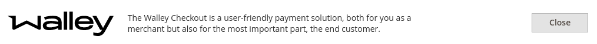
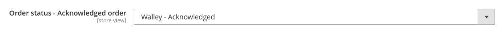

## Introduction

Walley Checkout for Magento 2 is an extension for Magento 2, allowing you to take payments via Walley.

Walley Checkout is an embedded checkout, a checkout solution that replaces the standard Magento One Page Checkout. This setup provides an easy way for the customer to complete the purchase and a convenient way for the merchant to offer multiple payment options in the same solution.

#### Limitations in functionality

An embedded checkout can imply certain limitations in functionality. Compatibility with other plugins that extend the functionality of the standard checkout might in some cases be limited. However some functionality is built into the module like automatically creating customer accounts on new orders, checkbox for signing up to newsletter and GTM datalayer.

#### Sign up with Walley

To get started with Walley Checkout, you need to create an account with Walley. If you’re not a customer yet you can register here [https://www.walley.se/foretag/checkout/](https://www.walley.se/foretag/checkout/).

#### Demo

If you want to try the checkout before installing it in your store you can check out our demo stores:

Sweden: https://e57aca208f.nxcli.io/
Norway: https://e57aca208f.nxcli.io/no/
Finland: https://e57aca208f.nxcli.io/fi/
Denmark: https://e57aca208f.nxcli.io/dk/
Germany: https://e57aca208f.nxcli.io/de/

To make test purchases you will need customer test data. This information can be found here: [https://dev.walleypay.com/docs/checkout/test-data/](https://dev.walleypay.com/docs/checkout/test-data/).

## Installation

#### Technical installation

The latest installation instructions can be found in the README.md file in the official repo [https://github.com/collector-bank/Checkout-Magento-2](https://github.com/collector-bank/Checkout-Magento-2).

#### Magento setup

* Installing HTTPS (a SSL/TLS certificate) in your web store is strongly recommended.
* Currency for the store must be the same as you are using in Walley (however base currency may differ). Currency for the Walley checkout is set in the Country setting, see below Walley Magento configuration below.
* The module is tested with the common tax settings for B2C and B2B. If you are using non-standard tax settings and/or additional testing on your side will be to recommend.
* If you are using currency switches it might require additional testing.

#### Walley Magento configuration

 Navigate to: Magento Admin → Stores → Configuration →  Sales → Payment Methods → In the list of Payment Methods you should see:
 
 
 
 Click on Configure and then expand the list of configuration fields:
 
 | Field | Comment|
 |-------|:-------|
 |Enabled| Enables or disables the module. If enabled, Walley will try to override all payment methods in the current Magento scope. It will also override the non-hard coded link to the checkout page in the current theme so that they lead to Walley checkout and not the standard one.|
 |Username|Walley Username – provided by Walley|
 |Password|Walley Password – provided by Walley. Sometimes also referred to as shared key or shared secret.  Normally a long text string like: Hh68d!xkV8bY_z_?T!_oJCNcxa$Rgy6A|
 |B2C StoreId|Merchant ID for B2C purchases for the selected country - Provided by Walley.|
 |B2B StoreId|Merchant ID for B2B purchases for the selected country - Provided by Walley.|
 |Country|The country where the checkout is used. The country selected here also defines the currency to use in Walley checkout, this needs to match the Magento configuration of the currency for that scope.|
 |Test mode|Enables test mode. If enabled the checkout will initiate a test session to Walley and use the test mode credentials below.|
 |Test mode Username|Test Mode Walley Username – provided by Walley.|
 |Test mode Password|Test Mode Walley Password – provided by Walley. Sometimes also referred to as shared key or shared secret. |
 |Test mode B2C StoreId|Test Mode Merchant ID for B2C purchases for the selected country - Provided by Walley.|
 |Test mode - B2B StoreId|Test Mode Merchant ID for B2B purchases for the selected country - Provided by Walley.|
 |Allowed Customers|Walley checkout supports private and business customers. Here you can select which of these you want to allow in the checkout or both. If both are selected and switch will appear on the checkout page where the customer can switch between them. If you are using different websites in Magento for different customer types you should only allow one customer type per website and not select both here. Selecting both here is only when you have both private and business customers in the same scope.|
 |Default Customer Type|The customer type selected here will be preselected when the checkout is loaded.|
 |Order status - Payment review order|A temporary order status for payment review orders before they are acknowledged by Walley as being paid. Payment review order has not been paid and should never be shipped or touched from the backend. Sometimes new orders are never acknowledged for different reasons e.g. the customer is not credit accepted, then the new order will automatically be deleted within 5 hours using a Magento cron job. It is highly recommended to use the default value.|
 |Order status - Acknowledged order|The order status for orders that have a valid payment and is acknowledged by Walley when orders are acknowledged they can be invoiced in Magento.  |
 |Order status - On Hold|The order status for orders on hold|
 |Order status - Denied order|The order status for orders that have been denied. This can e.g. be because of a suspected fraud.|
 |Terms and Conditions URL|The url to the webshop that has the terms and conditions. It must be provided as a complete link starting with http:// or https://e.g. https://www.democommunity.com/terms|
 |Create Customer Accounts|If set to yes a customer account will be automatically created for the customer /guest  that places. Yes = Customer accounts are created automatically for new email addresses. Orders are placed on the customer account. New customers get new customer email sent. No = Customers are checked out as guests no customer accounts are created.|
 |Custom base URL - Used during development|This only needs to be set in development if the development is done behind a firewall on a server/computer that has no direct url accessible from internet and you are using a proxy.|
 |Profile Name B2C|Optional field provided by Walley if needed. If you have been provided with a profile name from Walley Bank, enter it here, otherwise leave this field empty.|
 |Profile Name B2B|Optional field provided by Walley if needed. If you have been provided with a profile name from Walley Bank, enter it here, otherwise leave this field empty.|
 |Style iframe data-lang|(optional) The display language. Currently supported combinations are: sv-SE, en-SE, nb-NO, fi-FI, da-DK and en-DE. Both sv-SE and en-SE are available for use with swedish partners. In the other cases, the country part must match the country code used when initializing the checkout session or it will be ignored. Setting this attribute is optional and will only be of interest when there is more than one language for any single country.|
 |Style iframe data-padding|(optional) Set this to none in order to cancel out the left and right padding inside the iframe (by adjusting its margins and width).|
 |Style iframe data-container-id|(optional) Set this to the id of an element on the page and the iframe will render inside this element instead of immediately above the script element of the loader script. Put the container element somewhere above the script element. This is to make sure the container element is loaded before trying to populate it with the iframe.|
 |Style iframe data-action-color|(optional) Set this to a hexadecimal color code to change the background color of call to action buttons, formatted as the following example #582f87. Button text color will automatically be set to dark gray instead of white if not enough contrast according to WCAG 2.0 level AA for large text.|
 |Style iframe data-action-text-color|(optional) Set this to override the automatic text color of call to action buttons. Valid values are black, white, #000000 and #ffffff. Other hexadecimal color values are also valid, but will be interpreted as either black or white (and instead of black, the actual text color will be dark gray).|

#### Setting up the delivery checkout

The delivery checkout will allow you to integrate your checkout experience with a third party shipping provider like unifaun. 

When this is set up, the available shipping methods will not be fetched from Magento, instead you will add your shipping methods from an external source e.g. unifaun delivery checkout. The shipping methods will be fetched dynamically depending on information about the current customer quote e.g. like weight, shipping address or cart subtotal.

The choice of shipping methods will be integrated into the payment iframe after the shipping address.  

Steps to set up the delivery checkout:
* Contact our merchant services and provide them with your shipping / unifaun API details.
* You will be provided with a profileName which you will have to enter in the Magento admin configuration under Profile Name B2C or Profile Name B2B (see above).
* Enable delivery checkout in the admin:

**Note**: In Unifaun delivery checkout it is possible to set up rules for shipment methods. Cart total and order weight are automatically sent to Unifaun, additional variables might need custom configuration.

Technical information how to retreive shipping data from orders, for e.g. integrating to business systems or printing address labels automatically. [Delivery checkout technical integration](deliveryCheckoutIntegration.md)

#### Swish orders

Swish orders follow the normal order flow however they are not registered as transactions in Walley settlements. Check out [https://dev.walleypay.com/docs/checkout/optional/swishformerchants](https://dev.walleypay.com/docs/checkout/optional/swishformerchants) for more information.

#### Test mode

After you have installed the module on your Magento 2 installation you can test it by running it in test mode. Test credentials for different scenarios can be found here [https://dev.walleypay.com/docs/checkout/test-data/](https://dev.walleypay.com/docs/checkout/test-data/).

#### Production mode

When ready activate production mode and start receiving orders!

## Common errors

#### The checkout loads as a blank page

If a blank page loads instead of the checkout page it is likely something in the Magento configuration is not entered correctly, check the Walley debug / error log for more specific information. Recheck your credentials, store ids and “Terms and Conditions URL”.

#### Items not in stock error message when placing orders

If you are receiving this error message directly after installing the checkout for all cases:

 
It is likely that you can not receive callbacks from Walley, possible reasons are:
* The Magento installation is behind a firewall and your “Custom base URL” proxy is not working.
* The Magento installation is on a password protected environment (common for stage environment).

#### Currencies are not matching

When the iframe loads there is an error message on top:

This is because the “Country” selected in the Walley Magento Configuration is not matching the currency selected.

The Magento configuration in Stores -> Configuration-> General -> Currency Setup must match the currency for the “Country” selected for the same Magento configuration scope.

## The checkout in action

#### Checkout process flow

Since Walley Checkout is an embedded checkout solution, order/cart data & customer data is passed between Magento and the Walley payment session. The extension uses Magento standard way of integrating payment methods and uses the Magento Gateway Command Pool [https://devdocs.magento.com/guides/v2.4/payments-integrations/payment-gateway/command-pool.html](https://devdocs.magento.com/guides/v2.4/payments-integrations/payment-gateway/command-pool.html).

The diagram below shows the simple happy case. It illustrates the communication that happens in the background while the checkout is in process:

#### Cleaning of New order

Before orders are acknowledged and a payment is accepted the orders have status:

It can happen that orders are created in Magento and never get acknowledged. As a merchant you will see these orders in the Magento Order view, it is important not to touch them and let them be either until they get Acknowledged by Walley or until they are automatically deleted by a cron job after 5 hours.

#### Order management

When an order is created in Magento and is acknowledged a reservation number is created in the Walley system, you have the possibility to handle the order management in Walley directly from Magento. This way you can save time and don’t have to work in both systems simultaneously.

**Note**: If you do operations on order in the Walley Merchant portal, e.g. activating it, you won’t be able to invoice it from Magento unless you select the Invoice offline option.

###### Invoice orders - Activate / Part activate

The Magento order management process starts when an order has status:

If you open an Acknowledged order in Magento admin it should have Payment information similar to:

To invoice the order open it in Magento and create an invoice as usual. Note that it is possible to part activate the invoice by online invoicing some items in on the order and not others:

When the invoice has been submitted in Magento:

The invoice is now activated in Walley merchant portal.

###### Refund orders - Credit / Part credit

When an invoice has been created it can be refunded (credited / part credited) from Magento backend. Open the invoiced order. In the tab invoices you will see a list of invoices created for that order (if the invoice has been part activated there will be one invoice for every activation), Click on View for the invoice:

Then click on Credit Memo:

As for part activations it is possible to part credit items here by modifying the Qtys in the Items list:

Furthermore it is possible to add adjustments using “Adjustment Refund” and “Adjustment Fee”, these will be added on the invoice in Walley merchant portal:

**Note**: Refund Shipping can not be part credited, either refund the whole amount or zero.

###### Cancel orders

An order can be cancelled if it has not yet been invoiced. Cancelling an order will remove the Walley reservation for that order, if the customer has paid here the payment will be automatically refunded and returned to the customer.

The cancel option will not be available for orders that are in a state that do not allow them to be cancelled. If an order has been invoiced, you should use the Refund / Credit functionality.

###### Complete order status flow chart

Below is a complete flow chart of the order states and statuses:

#### Debugging the checkout

For debugging purposes a dedicated error log is stored for errors related to the checkout in:
/magento-root/var/log/collectorbank.log

## Miscellaneous

#### GTM tracking and Data Layer

The Walley checkout adds standard GTM Data Layer for Google Analytics and Google Analytics Enhanced Ecommerce on the success page.
 
Example of Google Analytics Data Layer on Checkout page:

 
Example of Google Analytics Enhanced Ecommerce Data Layer on Checkout page:
 

#### Order confirmation emails

Standard functionality for sending out order confirmation email has been overridden. Normally in Magento emails are sent when an order is created / placed and has status payment review / pending. In the case of Walley checkout the order confirmation email is sent when the order has a confirmed payment and get status Acknowledged.

#### Orders placed by existing customers

As described in the Magento Walley configuration section there is a setting whether to create customers automatically or not on new orders, if this is set to yes a customer in Magento is created in Magento if it does not exist since before.
However, in addition to this there is an automatic association built in to the module that is good to be aware of: 

If an order is placed and a customer with that email exists for that scope, the order will be associated with that customer and not registered as guest order, even though the customer is not logged in when placing the order.

#### Available countries and stores

 | Country | Currency | Language code | B2C | B2B |
 |---------|----------|---------------|-----|-----|
 | Sweden | SEK |sv-SE | Yes | Yes |
 | Norway | NOK | nb-NO | Yes | Yes |
 | Finland | EUR | fi-FI | Yes | Yes |
 | Denmark | DKK | da-DK | Yes | Yes |
 | Germany | EUR | en-DE | Yes | No |

## Troubleshooting

In order to make the troubleshooting as effective please provide the below information when in contact with Walley Merchant Services.

* Which browser was used and what version. This will give support a possibility to exclude if the problem only occurs in a specific browser or version. 
* A step by step instruction how the merchant or customer came across the issue, if possible please provide as much details as possible in order to make the troubleshooting as effective and quick as possible. 
* Login/account details to the merchant/customers Magento admin.
* All information from Walley regarding their privateToken, all requests that have been sent is preferable.
* What version of the module has been used, please specify. 
